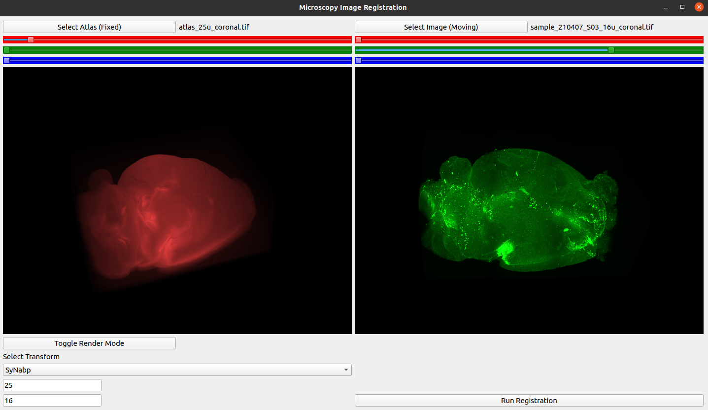
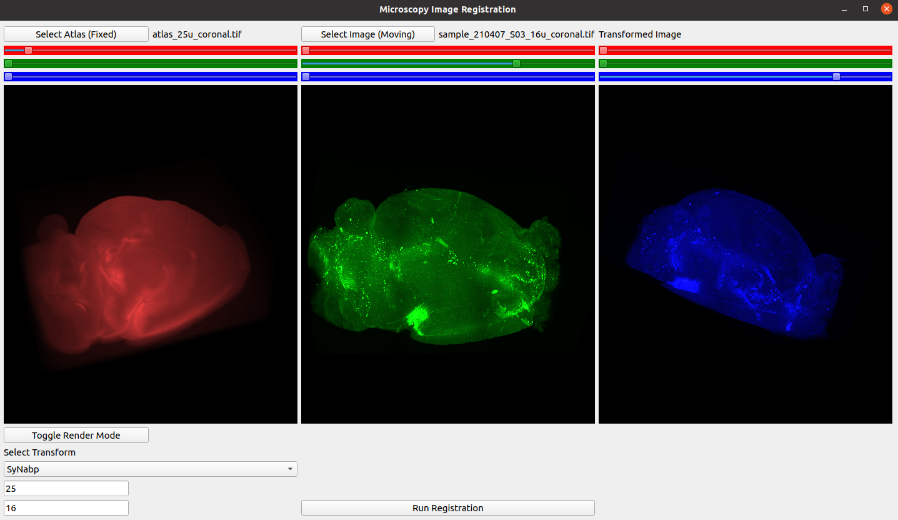
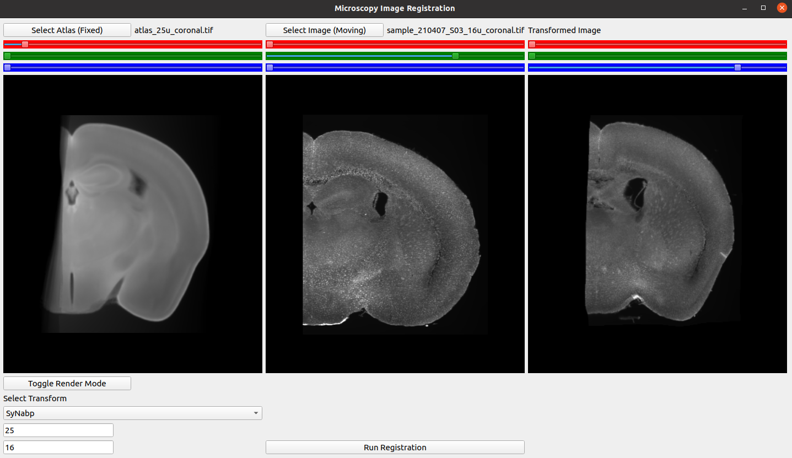
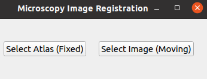

# Microscopy Image Analysis Software

Desktop application that allows you to view and analyze volumetric microscopy or medical image data. Currently, the application has the following features:

- Visualization of volumetric data in 2-D and 3-D views
- Automated image registration with various transformations

The following main packages and libraries have been utilized for the implementation of the software:

- **PyQt5** for the GUI widgets
- **[vtk](https://vtk.org/)** for the visualization of the volumetric image data
- **[ants](http://stnava.github.io/ANTs/)** for the computations and image registration algorithm 

As the future work, following new features can be added to the software:

- Preprocessing operations on volumetric images
- Automated segmentation of volumetric images

Here are some screenshots I take from this GUI software:

Figure : Sample visualization of atlas (fixed) and moving light sheet microscopy images in 3-D view				

​	

Figure : Sample visualization of atlas (fixed), moving and transformed microscopy images after running the registration algorithm

Figure : Sample visualization of atlas (fixed), moving and transformed microscopy images in 2-D coronal view

### Libraries:

Here is the full list of libraries that I have used in this software:

- ants
- numpy
- tifffile
- PyQt5
- vtk

All of them can be installed via **pip** package manager

### How to Run:

After installing the required packages, simply run the `imaging_gui.py` and it will open the following window where you can select your fixed (atlas) and moving image files:

​														Figure : Initial window

After you select your images, the software will render the images in 3-D view and allow you to run the registration algorithm
